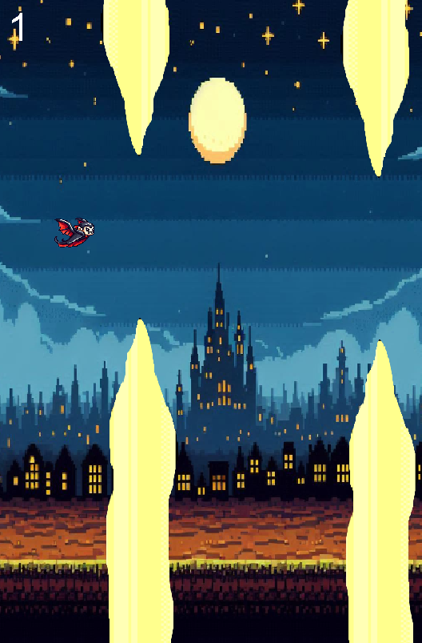

# Dracula's Flight

**Dracula's Flight** is a simple 2D side-scrolling game where the player controls Dracula as he flies through the screen, avoiding pipes and trying to survive for as long as possible. The player can make Dracula jump by pressing the spacebar to avoid colliding with pipes.

## How the Game Looks



## Features
- **Gravity-based movement**: Dracula falls due to gravity, and you can make him jump with the spacebar.
- **Pipes**: Randomly generated pipes appear on the screen that Dracula must avoid.
- **Score System**: Points are earned each time Dracula successfully avoids a set of pipes.
- **Game Over**: The game ends when Dracula collides with a pipe or falls out of bounds.
- **Restart on Game Over**: Press space to restart the game after a game over.

## Installation
To run this game locally, follow these steps:

1. **Clone the repository**:
    ```bash
    git clone https://github.com/yourusername/draculas-flight.git
    cd draculas-flight
    ```

2. **Requirements**:
    - Java 8 or higher
    - IDE (e.g., IntelliJ, Eclipse) or command line setup

3. **Run the Game**:
    - Open the project in your preferred IDE (or compile/run from the command line).
    - Run `App.java` to start the game.

## Controls
- **Spacebar**: Press to make Dracula jump.
- **Game Over**: When the game is over, press **spacebar** again to restart.


## Files Structure
- **App.java**: The main class that starts the game.
- **DraculasFlight.java**: Contains the game logic, rendering, and controls.
- **assets/**: Folder containing game assets like images (e.g., `top.png`, `bottom.png`, `vamp-sprite.png`).

